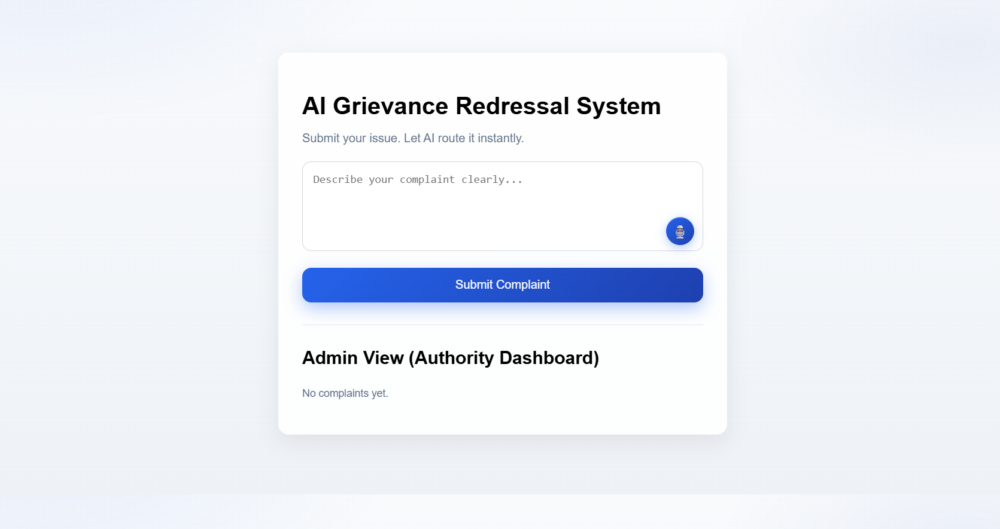

# Project Name
Smart Grievance Management Platform
---

# Team Name
Geekoder

---

# Deployed Link (Optional)
Not deployed (Demonstrated locally)
Due to shortange of time we have not deployed the project on any platform. However, we have demonstrated the project locally.
As if we deploy it in vercel we need api for backend deployment.

---

## Screenshots

### Complaint Submission Interface


### Admin Dashboard (Priority-based Queue)


# 2-minute Demonstration Video Link
[https://drive.google.com/file/d/1n3AhjySpW8vDAELEXPk4FB-pQhu4ol6K/view?usp=sharing]

---

# PPT Link
[https://1drv.ms/p/c/7300b57b728b2378/IQB4Ojic9I-VR4F6IZLQfSIeAZPcvE1Ji00cpY4QehxT5S8?e=lO30YL&nav=eyJzSWQiOjI1Nn0]

---

## Project Overview
The AI-Driven Grievance Redressal System allows citizens to submit complaints in natural language.  
The backend analyzes each complaint using NLP-based logic to determine the category, urgency, and the appropriate department.

Authorities receive a prioritized queue of complaints, enabling faster response to critical and safety-related issues while efficiently managing service-related grievances.

The system focuses on automation, transparency, and ease of use.

---

## Key Features
- Natural language complaint submission
- Automatic complaint classification
- Priority-based grievance handling (High / Medium / Low)
- Intelligent department routing
- Real-time admin dashboard
- Offline complaint handling
- Simple and user-friendly interface

---

## Tech Stack
### Frontend
- HTML
- CSS
- JavaScript

### Backend
- Node.js
- Express.js
- Rule-based NLP logic

---

## Project Structure
GFGBQ-Team-geekoder/
├── backend/
│ ├── server.js
│ ├── logic.js
│ └── package.json
├── frontend/
│ ├── index.html
│ ├── style.css
│ └── script.js
├── screenshots/
│   ├── admin.png
│   └── home.png
└── README.md


---

## Setup and Installation Instructions

### Backend Setup
```bash
cd backend
npm install
node server.js

The backend will start on:
http://localhost:3000

on the browser:
http://localhost:5500


Usage Instructions:

1. Enter a complaint in natural language.

2. Click on Submit Complaint.

3. The system analyzes the complaint using NLP.

4. Complaint is prioritized and routed automatically.

5. Admin dashboard displays complaints sorted by priority.


Future Scope:

- Integration with ML-based NLP models for improved accuracy

- Cloud deployment for scalability

- User authentication and complaint tracking for secure access

- Analytics for government authorities to monitor system performance and user satisfaction